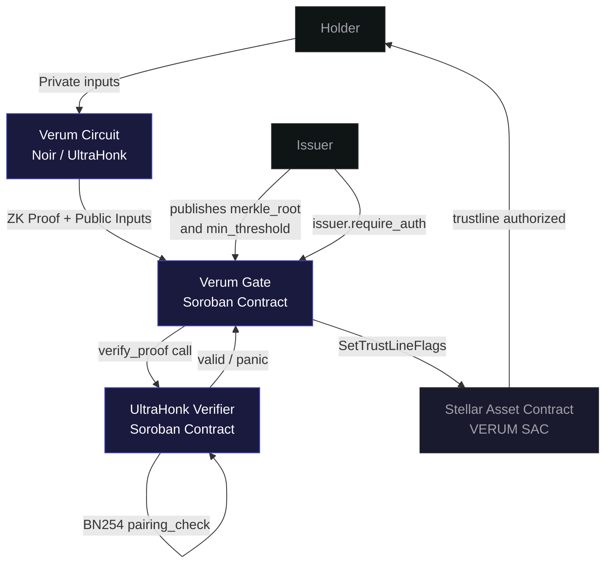
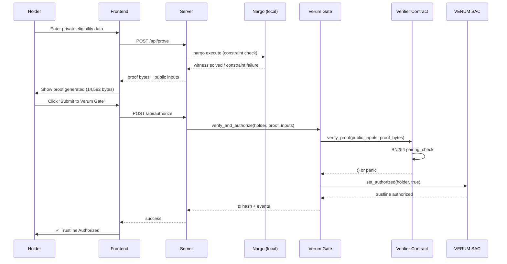

# Verum
Prove you qualify, without proving who you are.

---

ZK-gated eligibility layer for tokenized real world assets on Stellar. Investors prove accreditation status, jurisdictional eligibility, and committed capital in a single zero knowledge proof. A Soroban smart contract verifies the proof on chain and authorizes the investor's trustline without the issuer collecting, storing, or accessing the underlying identity or financial data.

Built for the Stellar Hacks: Real-World ZK hackathon.


## The Problem

Stellar's `AUTH_REQUIRED` trustline flag enables issuers to control which accounts can hold regulated assets. This capability is essential for tokenized real world assets. Products such as Franklin Templeton's BENJI fund, tokenized bond platforms, and regulated stablecoins use authorized trustlines to enforce compliance requirements including investor accreditation, jurisdictional eligibility, and minimum capital thresholds.

The limitation is that authorization decisions require the issuer to verify each investor's eligibility using sensitive personal information. Today, this means collecting and processing identity documents, KYC records, accreditation evidence, and financial information before authorizing a trustline.

As a result, compliant RWA issuers become custodians of highly sensitive personal data for every eligible holder. This increases regulatory obligations, expands the attack surface for data breaches, and creates unnecessary privacy risk. The dependency exists because Stellar's authorization model does not natively support zero knowledge proofs of regulatory eligibility. Authorization decisions therefore require off chain verification of investor identity and compliance data before a trustline can be approved.

Existing approaches do not eliminate the underlying trust assumption.

| Approach                                 | Limitation                                                                                                                                                        |
| ---------------------------------------- | ----------------------------------------------------------------------------------------------------------------------------------------------------------------- |
| Issuer managed KYC databases             | Issuers collect and store investor identity and compliance data, increasing regulatory obligations and data breach risk.                                          |
| On chain allowlists (Securitize, Tokeny) | Authorization is based on off chain identity verification. The issuer or identity provider still maintains the mapping between investors and authorized accounts. |
| Nethermind Privacy Pools                 | Protects transaction privacy but does not address issuer side compliance or trustline authorization.                                                              |
| Stellar association sets and view keys   | Improve selective disclosure but still rely on a trusted service provider with access to the underlying compliance data.                                          |

None of these approaches remove the requirement for a trusted party to possess and verify the underlying identity and compliance information. Verum replaces that requirement with zero knowledge proofs that can be verified on chain.


## The Solution

Replace manual eligibility verification with a zero-knowledge proof.

During onboarding, an investor commits their eligibility attributes using a Pedersen hash without disclosing the underlying identity or financial data. When requesting trustline authorisation, the investor generates a Noir proof that the committed attributes satisfy the issuer's published eligibility policy. A Soroban smart contract verifies the proof on-chain using BN254 pairing verification. Once the proof is validated, the authorisation workflow approves the investor's trustline without exposing the underlying eligibility data.

The issuer publishes an eligibility policy and verification key instead of maintaining a database containing investor identity documents and compliance records.

The privacy guarantee is independent of regulatory interpretation. The issuer never receives the underlying personally identifiable information required to generate the proof, eliminating the need to store, secure, or disclose that data as part of the authorisation workflow.


## Why Verum Is Different

Existing compliance architectures for regulated digital assets rely on a trusted party to maintain an allowlist derived from off-chain identity verification. The trusted party may be the issuer, a transfer agent, or a compliance service provider, but the underlying identity database still exists.

Verum replaces that dependency with zero knowledge proofs. Trustline authorization is based on cryptographic verification of eligibility rather than disclosure of identity and compliance records.

Our review of existing implementations found no prior system that combines zero knowledge proof based eligibility verification with Stellar trustline authorization.

- Existing RWA platforms such as Securitize, Tokeny, and Polymesh rely on conventional identity verification with allowlists derived from off chain compliance processes.
- Nethermind Privacy Pools focuses on transaction privacy rather than issuer side authorization.
- Stellar's association sets architecture improves selective disclosure but still depends on a trusted provider to maintain eligibility information.

The zero knowledge proof is a core protocol component rather than an added privacy feature. It enables authorization decisions to be verified without requiring the issuer or another trusted intermediary to access the underlying identity and compliance data.


## Architecture

### System Overview


### The Three-Contract Stack

```
┌─────────────────────────────────────────────────────────────┐
│  UltraHonk Verifier Contract                                │
│  Cryptographic validity only. Stores VK at deploy time.     │
│  verify_proof(public_inputs, proof_bytes) → () or panic     │
├─────────────────────────────────────────────────────────────┤
│  Verum Gate Contract                                        │
│  Policy + Application layer. Calls verifier, then SAC.      │
│  verify_and_authorize(holder, proof, inputs) → ()           │
├─────────────────────────────────────────────────────────────┤
│  Stellar Asset Contract (VERUM SAC)                         │
│  Protocol-native compliance flags. AUTH_REQUIRED enforced.  │
│  SetTrustLineFlags → trustline authorized                   │
└─────────────────────────────────────────────────────────────┘
```

This separation follows the canonical Stellar ZK pattern: verifier handles cryptographic validity only, the Gate handles business logic, and the SAC handles state transition. Each layer has exactly one responsibility.

### Data Model

Each investor computes a Pedersen hash during onboarding:

```text
commitment = pedersen_hash(
    accredited_flag,
    country_code,
    committed_capital,
    secret_nonce
)
```

| Field                   | Visibility            | Description                                                                               |
| ----------------------- | --------------------- | ----------------------------------------------------------------------------------------- |
| `accredited_flag`       | Private               | Boolean indicating whether the investor satisfies the issuer's accreditation requirement. |
| `country_code`          | Private               | ISO 3166-1 numeric country code representing the investor's jurisdiction.                 |
| `committed_capital`     | Private               | Capital committed by the investor, denominated in USD (`u64`).                            |
| `secret_nonce`          | Private               | Random nonce that prevents commitment correlation across issuers and onboarding events.   |
| `commitment`            | **Public (on chain)** | Pedersen hash of the four private fields, stored on chain.                                |
| `merkle_root`           | **Public (on chain)** | Merkle root representing the issuer's allowlist of permitted jurisdictions.               |
| `min_capital_threshold` | **Public (on chain)** | Minimum capital required by the issuer for trustline authorization.                       |


## The Circuit

The Verum circuit (`verum_circuit/src/main.nr`) proves four independent predicates in a single UltraHonk proof. Verification succeeds only if every predicate is satisfied.

```rust
fn main(
    // Private inputs — known only to the holder, never transmitted
    accredited_flag: Field,
    country_code: Field,
    committed_capital: u64,
    secret_nonce: Field,
    sibling0: Field,
    direction0: bool,
    sibling1: Field,
    direction1: bool,

    // Public inputs — available to both the holder and the on-chain verifier
    commitment: pub Field,
    merkle_root: pub Field,
    min_capital_threshold: pub u64
) {
    // Check 1: Commitment consistency
    // Verifies that the private inputs match the published commitment.
    let computed_commitment = std::hash::pedersen_hash(
        [accredited_flag, country_code, committed_capital as Field, secret_nonce]
    );
    assert(computed_commitment == commitment);

    // Check 2: Accreditation
    assert(accredited_flag == 1);

    // Check 3: Jurisdiction membership
    // Verifies that the holder's jurisdiction belongs to the issuer's allowlist
    // without revealing which jurisdiction it is.
    let leaf = std::hash::pedersen_hash([country_code]);
    let node0 = if direction0 {
        std::hash::pedersen_hash([sibling0, leaf])
    } else {
        std::hash::pedersen_hash([leaf, sibling0])
    };
    let computed_root = if direction1 {
        std::hash::pedersen_hash([sibling1, node0])
    } else {
        std::hash::pedersen_hash([node0, sibling1])
    };
    assert(computed_root == merkle_root);

    // Check 4: Capital threshold
    // Verifies that the committed capital satisfies the issuer's minimum
    // requirement without revealing the committed amount.
    assert(committed_capital >= min_capital_threshold);
}
```

The circuit combines four classes of verification:

* **Commitment consistency** binds all private inputs to a single published Pedersen hash.
* **Equality constraint** verifies accreditation status.
* **Merkle membership proof** verifies jurisdiction eligibility without revealing the holder's jurisdiction.
* **Comparison constraint** verifies that committed capital meets the issuer's minimum threshold without revealing its value.

The commitment consistency check prevents proof forgery through attribute substitution. Because every private attribute is bound to a single Pedersen hash, an attacker cannot combine valid values from different investors or different onboarding sessions to construct a proof that satisfies the eligibility policy.

### Permitted Jurisdiction Tree

For the demo, four jurisdictions are committed into a 4-leaf Pedersen Merkle tree:

```
                    root
                 0x2356709c...
                /             \
          node01               node23
       0x11969ea7...        0x27888d46...
       /         \           /         \
   leaf0(US)  leaf1(GB)  leaf2(CA)  leaf3(DE)
```

The issuer publishes only the `root`. A holder proves their country code is one of the four leaves via a 2-sibling Merkle path, revealing nothing about which specific country they are.


## End-to-End Flow




## Technology Stack

| Technology                                                                  | Role                           | Why                                                                                                                                                                                 |
| --------------------------------------------------------------------------- | ------------------------------ | ----------------------------------------------------------------------------------------------------------------------------------------------------------------------------------- |
| **Noir** (`v1.0.0-beta.22`)                                                 | ZK circuit language            | Rust-inspired DSL for expressing arithmetic circuits. Compiles eligibility constraints into UltraHonk-compatible proving circuits.                                                  |
| **Barretenberg** (`v0.87.0` for on-chain, `v5.0.0-nightly` for development) | Proving backend                | Aztec's UltraHonk proving system. `v0.87.0` is pinned for compatibility with the deployed verifier contract, while the nightly build is used for circuit development.               |
| **Soroban** (Rust)                                                          | Smart contract platform        | Executes on-chain proof verification using Stellar's native BN254 pairing host functions.                                                                                           |
| **BN254 / UltraHonk**                                                       | Proof system                   | Matches the elliptic curve and pairing primitives exposed by Stellar's Protocol 25/26 host functions, enabling efficient on-chain verification.                                     |
| **Pedersen hash**                                                           | Commitments and Merkle hashing | Available through `std::hash::pedersen_hash` in the Noir standard library. Efficient inside arithmetic circuits and used consistently for commitments and Merkle tree construction. |
| **Stellar Asset Contract (SAC)**                                            | Asset and trustline management | Integrates proof verification with Stellar's existing trustline authorization workflow instead of introducing a separate compliance mechanism.                                      |
| **`env.invoke_contract()`**                                                 | Cross-contract invocation      | Invokes the deployed UltraHonk verifier directly, avoiding ABI incompatibilities encountered with generated client bindings for `Bytes` parameters.                                 |
| **`@stellar/stellar-sdk`**                                                  | JavaScript SDK                 | Builds, signs, and submits Stellar transactions from the demonstration backend.                                                                                                     |
| **Express.js**                                                              | Demonstration backend          | Serves the frontend and exposes `/api/prove`, `/api/authorize`, and `/api/create-trustline` endpoints.                                                                              |
| **`indextree/ultrahonk_soroban_contract`**                                  | On-chain verifier              | Forked as the verifier implementation. Stores the verification key at deployment and exposes `verify_proof(public_inputs, proof_bytes)`.                                            |

### Key engineering decisions

**Why `env.invoke_contract()` instead of `contractimport!`?**

The `contractimport!` macro generates strongly typed client bindings from a contract specification. During integration, those bindings produced incompatible encoding for `Bytes` arguments during cross-contract invocation. `env.invoke_contract()` passes host objects directly, matching the deployed verifier contract's expected interface.

**Why maintain two Barretenberg versions?**

The deployed verifier contract was generated with **Barretenberg `v0.87.0`** using `--oracle_hash keccak --output_format bytes_and_fields`. Proofs produced by newer releases use a different serialization format and are incompatible with that verifier. The project therefore pins `v0.87.0` for producing deployment artifacts while using the latest nightly release for circuit development.

**Why Pedersen hash instead of Poseidon2?**

At `Noir v1.0.0-beta.22`, the Poseidon2 implementation is internal to the standard library (`pub(crate)`) and is not available through the public API. `std::hash::pedersen_hash` is fully supported, stable, and validated against the Noir standard library's published test vectors, making it the appropriate choice for commitments and Merkle hashing.


## Repository Structure

```
verum/
├── verum_circuit/              # Noir ZK circuit
│   ├── src/main.nr             # The four-check eligibility circuit
│   ├── Prover.toml             # Demo input values
│   └── target/
│       ├── proof               # Pre-generated proof (keccak oracle, bytes_and_fields)
│       ├── public_inputs       # Public inputs matching proof
│       ├── vk                  # Verification key (deployed with verifier contract)
│       └── verum_circuit.json  # Compiled circuit artifact
│
├── verum_gate/                 # Soroban Gate contract (Rust)
│   └── contracts/verum-gate/
│       └── src/lib.rs          # verify_and_authorize → verify_proof → set_authorized
│
├── frontend/                   # Demo application
│   ├── server.js               # Express backend (proof validation + Stellar calls)
│   └── public/
│       └── index.html          # Single-page demo UI
│
└── ultrahonk_soroban_contract/ # Forked reference verifier (git submodule)
```


